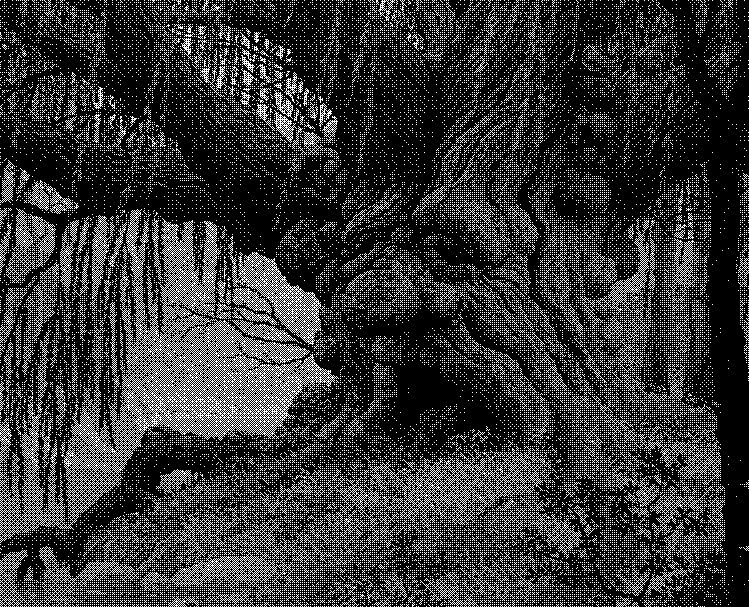
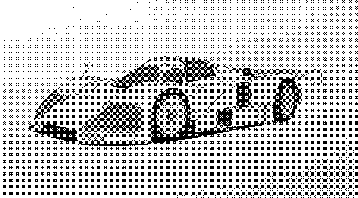
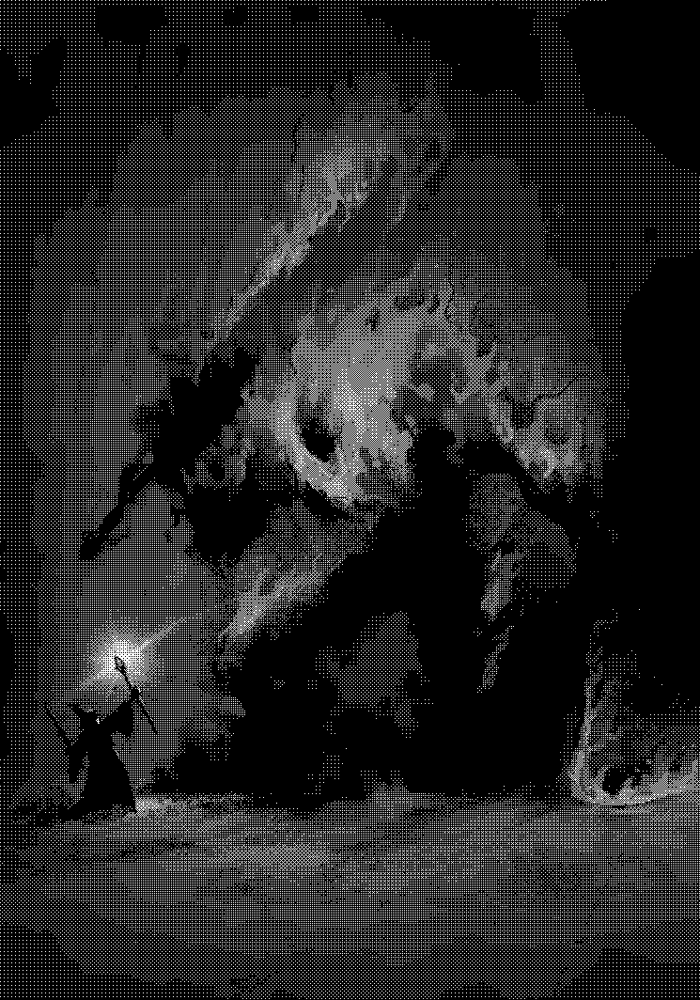
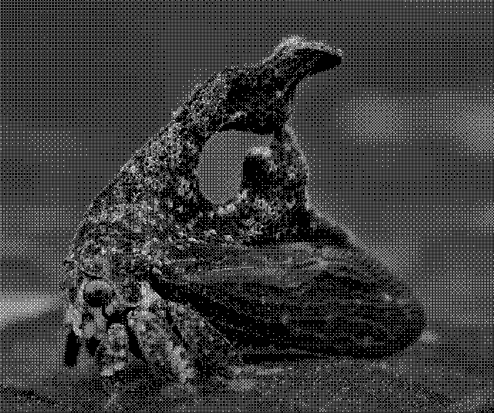

# Image Ditherer

### Installation
- Install Rust ([instructions](https://doc.rust-lang.org/book/ch01-01-installation.html))
- Install sdl2 lib ([instructions](https://github.com/Rust-SDL2/rust-sdl2))
- `git clone https://github.com/gabrielracz/ditherer.git && cd ditherer`
- `cargo build --release`

### Usage
- `./target/release/ditherer path/to/input/image path/to/output`
- mouse wheel or `j` and `k` to zoom
- `o` and `p` to adjust darkness
- `1`, `2`, and `3` to select detail level (bayer matrix size)
- `s` to save

 ### Samples
Make sure your browser is on 100% zoom to appreciate the single-pixel glory.

